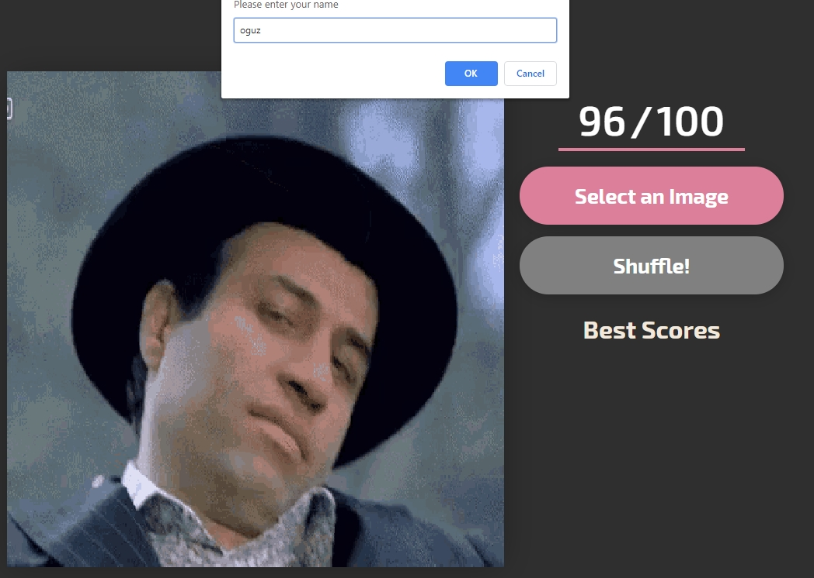

# PuzzleJS
🧩 YAZLAB2 - 1

## Getting Started

You can have a copy of this project easily to take these following steps.

You have to have NodeJS.

[Download here.](https://nodejs.org/en/download/)

## Installation 

After NodeJS you need to install these packages.

```
npm install -g nodemon
npm install
```

Then you can start the project on localhost with

```
npm start
```

Default port is 4540. Also can change it from 'index.js'.

Program uses `localhost:4540` address.

Have Fun!

## Rules

+ Player has to upload an image before the game via `Select an Image` button.

+ Game starts after the first right shuffle.

+ If there are no true pieces after the first shuffle, Player has to shuffle till the right pieces via `Shuffle` button.

+ +6 points per each true pieces.

+ -4 points per each wrong moves.


### You can just hit the 100 points with a flawless shuffle. 

##### (So there are no skills you just need a some RNG! **BlessRNG**)

### Shuffle


### Congratz


## Configuration

* [NodeJS](https://nodejs.org/en/) - JavaScript runtime based on Chrome V8 JavaScript Engine

## Authors

- **Ata Gülalan**  - [atagulalan](https://github.com/atagulalan)
- **Oğuzhan Türker** - [oguzturker8](https://github.com/oguzturker8)

## Licance

* MIT
